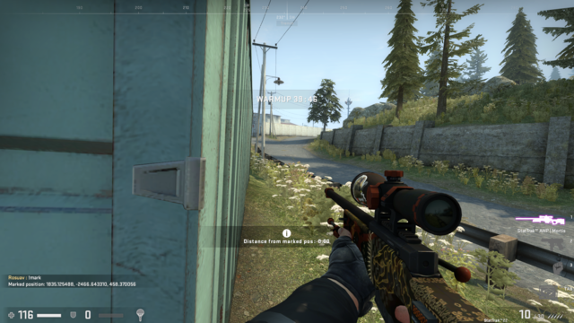

Distances on Blacksite
======================

The battle royale mode "Danger Zone" introduced in 2018, features wider open
spaces than classic modes do. Engagements tend to take place at greater ranges,
the detonation of C4 doesn't end the game (although it can still be heard over
the whole map - Valve pls fix), and it's possible to have theoretical line of
sight across such distance that rifle bullets actually stop being tracked.

Width of Radio
--------------

Marked location: 

~2600 HU to the opposite corner - approximately the same as [bottom mid to T
spawn on Dust II](DustII.md#mid-to-t-spawn).

* Unscoped 
* Scoped 
* Double-scoped 

500 HU ruler
------------

* The open space at the top of Radio gives an easy 500 HU ruler. TODO: Redo this
with two people standing 500 HU apart, looking at each other.

  - From here 

  - To here 

* Another 500 HU ruler can be found at Delta. The house front is just over 500 HU wide.

  - From here 

  - To here 

Water tower
-----------

Marked location: 

* To the pier east of Gas Station: 4000 HU
  - Unscoped 
  - Scoped 
  - Double-scoped 

TODO: Get some more measurements like these (probably again with two people).
Would it be useful to measure to Radio (circa 6K HU)?

Box sizing
----------

(Border box.)

* Green container near Trench (TODO: check if it's the same for other shipping
containers): 427 HU
  - From here 
  - To here 
* Dronegun box: 154 x 178 HU
  - From here 
  - Short side (width) 
  - Long side (length) 
