Distances on Dust II
====================

Unarguably the most iconic map of CS:GO, Dust II is a classic 5v5 defusal map
and has the typical distances of such maps.

A site
------

Distances are marked to the painted X at the site itself.

* Popping around the box: 100 HU to the pockmark
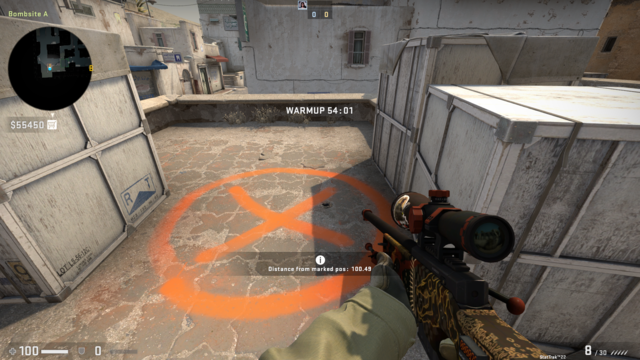

* Approaching the site itself: 500 HU
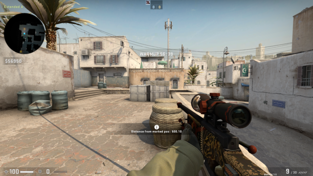

* From Short: 900 HU
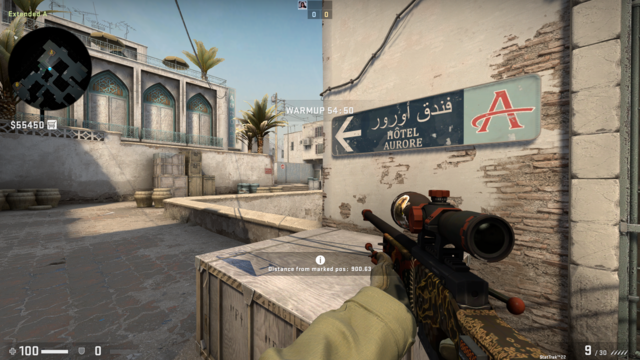

* From Pit: 2000 HU
  - Unscoped 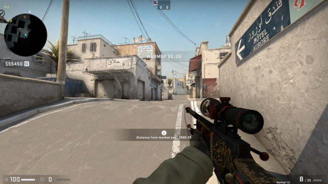
  - Scoped 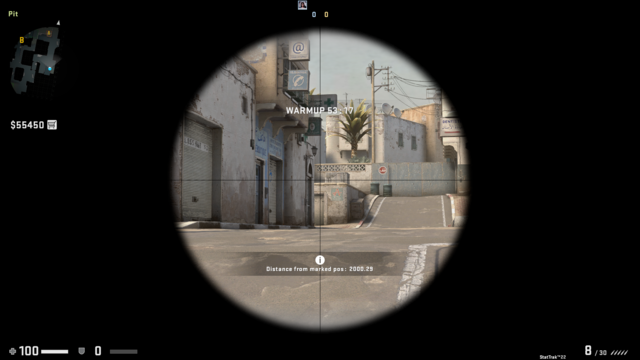
  - Double-scoped 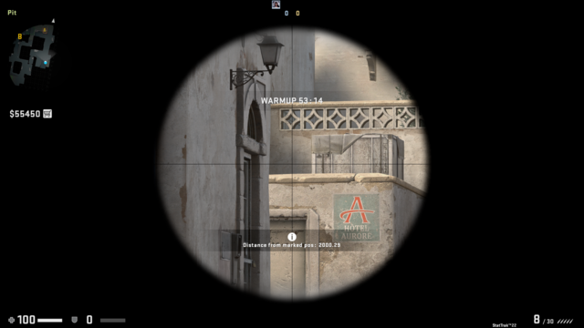

Mid, from T spawn
-----------------

Marked location: 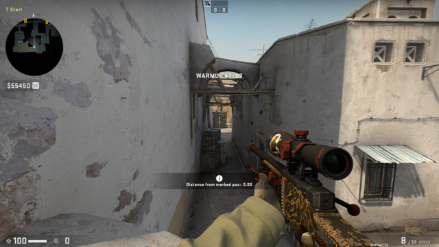

* From mid doors: 2500 HU
  - Unscoped 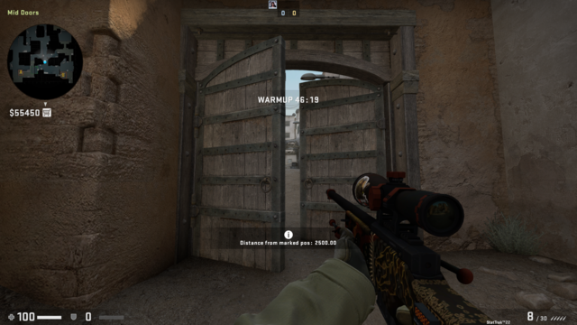
  - Scoped 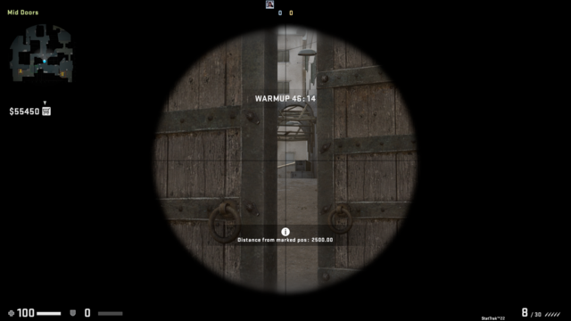
  - Double-scoped 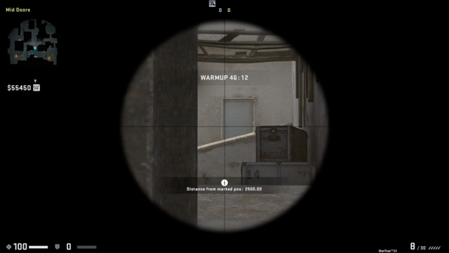

* From truck: 3000 HU
  - Unscoped 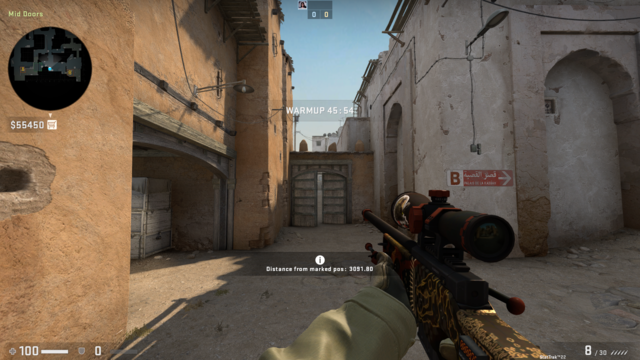
  - Scoped 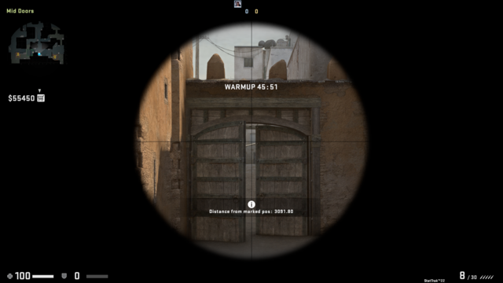
  - Double-scoped 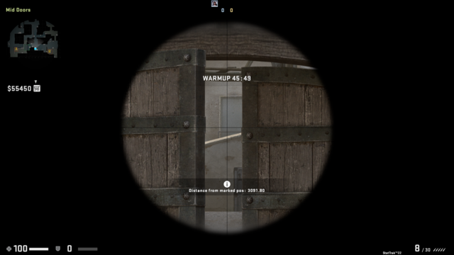
