Distances on Dust II
====================

Unarguably the most iconic map of CS:GO, Dust II is a classic 5v5 defusal map
and has the typical distances of such maps.

A site
------

Distances are marked to the painted X at the site itself.

* Popping around the box: 100 HU to the pockmark

* Approaching the site itself: 500 HU

* From Short: 900 HU

* From Pit: 2000 HU
  - Unscoped 
  - Scoped 
  - Double-scoped 

Bedroom/Long Doors
------------------

Peeking out of Long Doors: 

1000 HU to the next corner.

* Unscoped 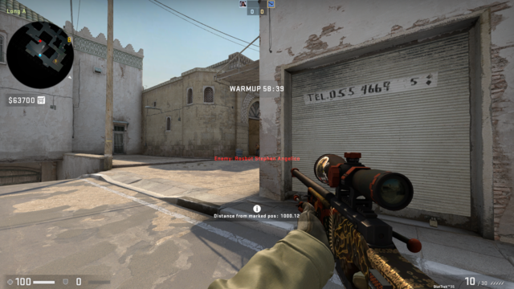
* Scoped 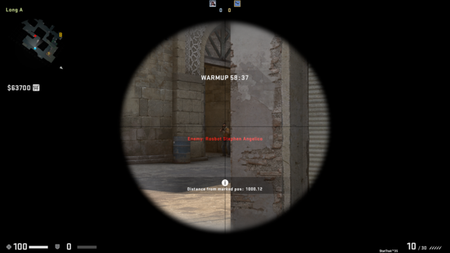
* Double-scoped 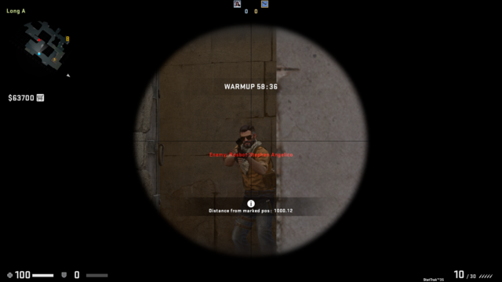

Hiding behind the skip: 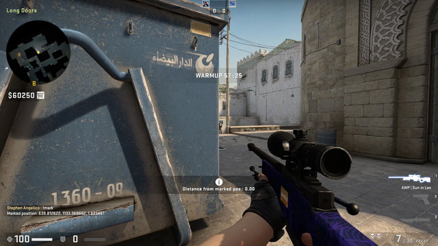

1000 HU to Pit.

* Unscoped 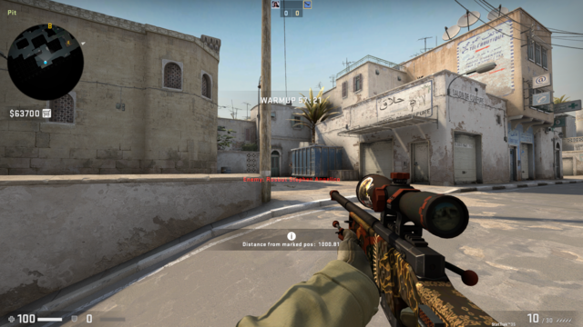
* Scoped 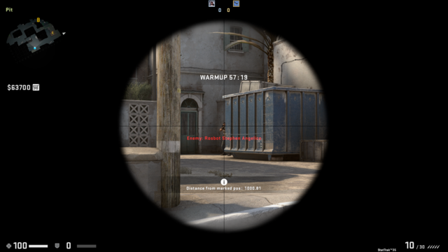
* Double-scoped 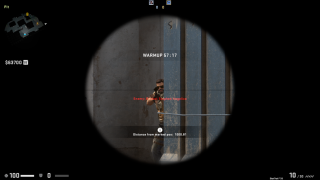

Mid - maximum distances on Dust II
----------------------------------

Marked location: 

* From mid doors: 2500 HU (approximately the same as [the width of Radio on
Blacksite](Blacksite.md#width-of-radio))
  - Unscoped 
  - Scoped 
  - Double-scoped 

* From truck: 3000 HU
  - Unscoped 
  - Scoped 
  - Double-scoped 

East-west, the greatest possible distance is 2750 HU.

* Unscoped 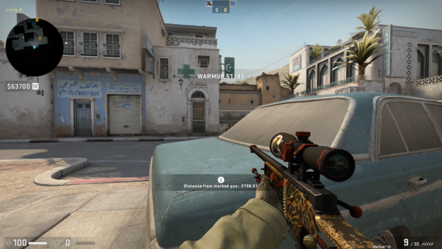
* Scoped 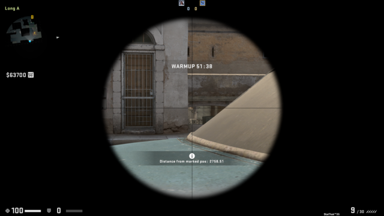
* Double-scoped 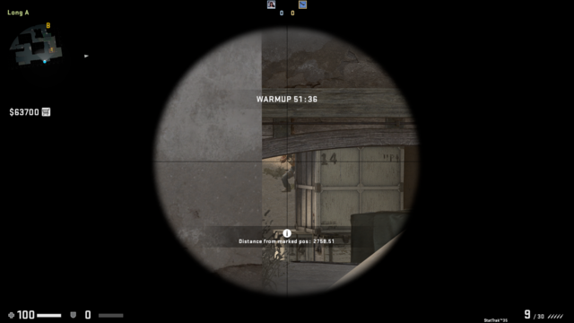

Catwalk
-------

Marked location: 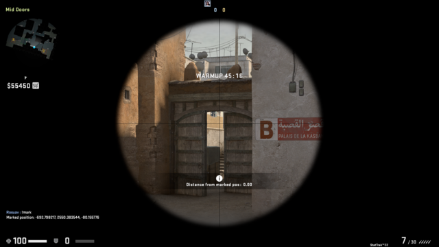

1750 HU at first clear sighting point.

* Unscoped 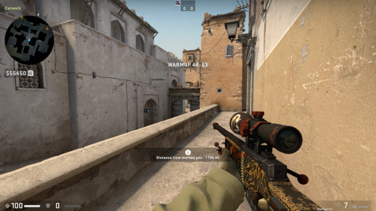
* Scoped 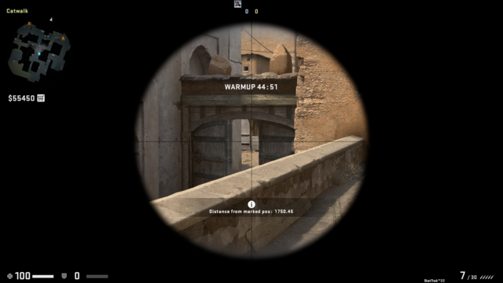
* Double-scoped 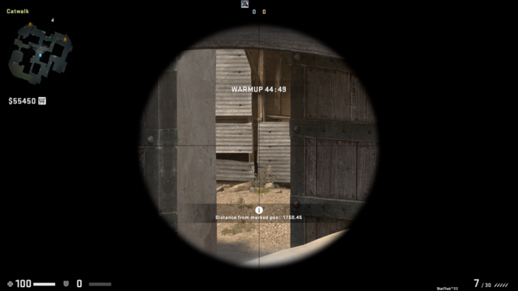

Marked location: 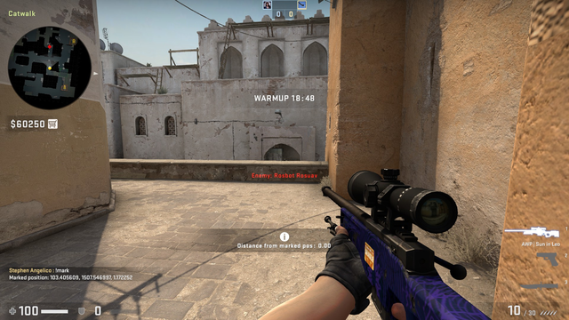

1200 HU from the back of lower tunnels.

* Unscoped 
* Scoped 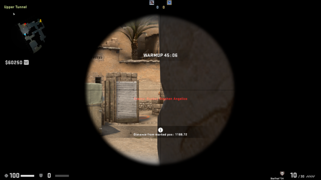
* Double-scoped 

Same place, looking up mid: 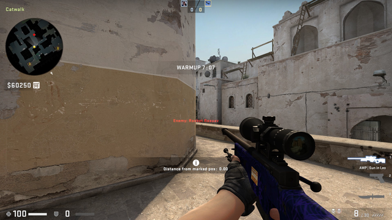

1000 HU from the back of lower tunnels.

* Unscoped 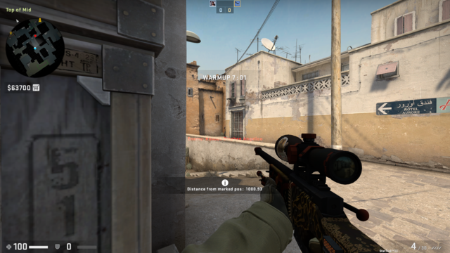
* Scoped 
* Double-scoped 

Peeking into Suicide: 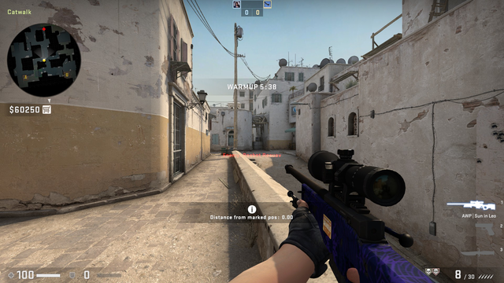

2000 HU all the way into Suicide.

* Unscoped 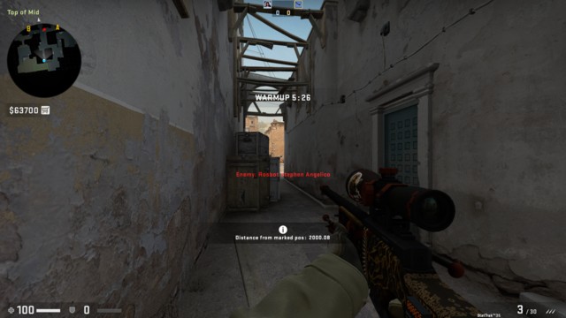
* Scoped 
* Double-scoped 

B site
------

Marked location: 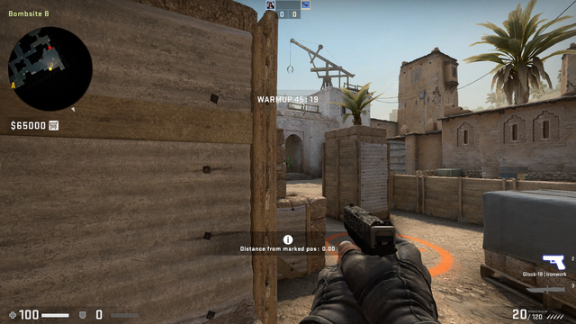

1200 HU from the mouth of the tunnel.

* Unscoped 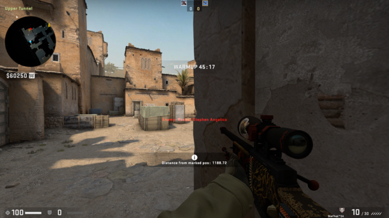
* Scoped 
* Double-scoped 

Marked location: 

1500 HU from peeking out of the tunnel.

* Unscoped 
* Scoped 
* Double-scoped 
