Distances on Sirocco
====================

Daner Zone's second map (after [Blacksite](Blacksite.md)) has similar distances
to its companion, but the spaces tend to be more open. Engagements still take
place at long range, and thanks to the removal of the fog, you can see your
enemies from even further away than on Blacksite.

Kasbah
------

Marked location: 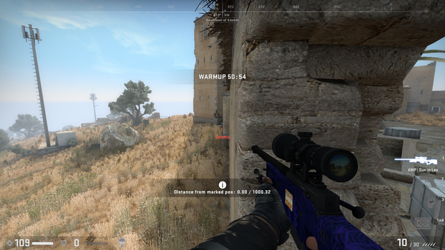

1000 HU to the next corner.

* Unscoped 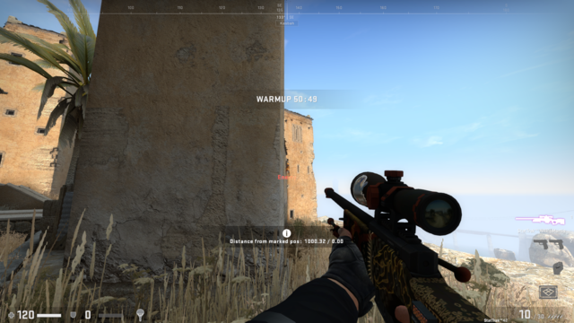
* Scoped 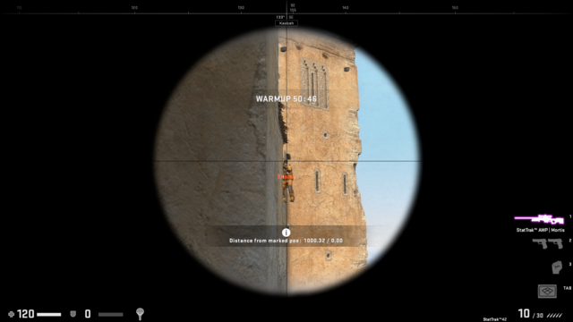
* Double-scoped 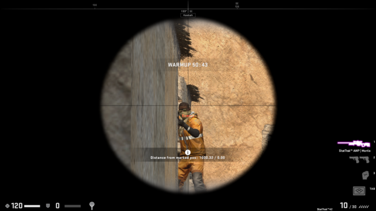

Dubyuh
------

Marked location: 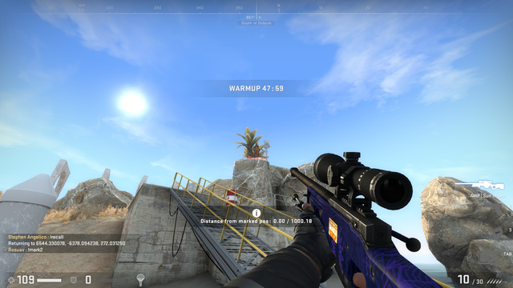

1000 HU to the rocks above. (Single-scope screenshot missing.)

* Unscoped 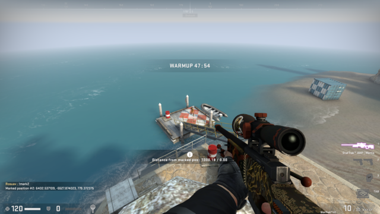
* Double-scoped 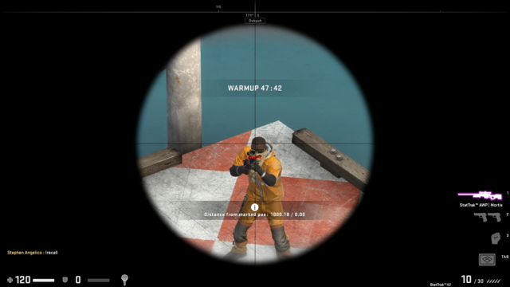

APC pipe
--------

Marked location: 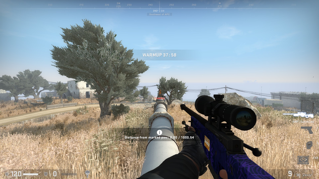

1000 HU to the bushy tree. The tree has a tendency to photobomb you...

* Unscoped 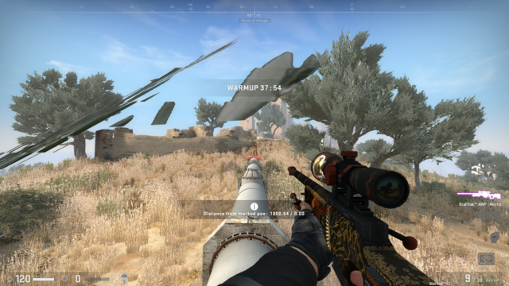
* Scoped 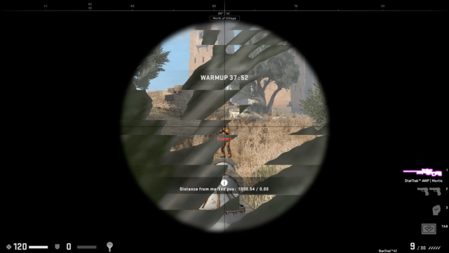
* Double-scoped 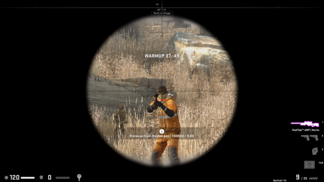

Paywalls
--------

Marked location: 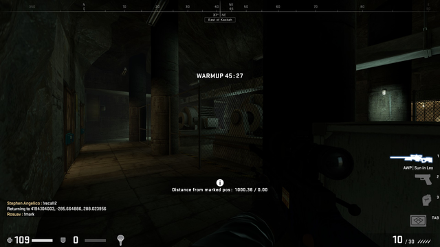

1000 HU across the main area near East Tunnels.

* Unscoped 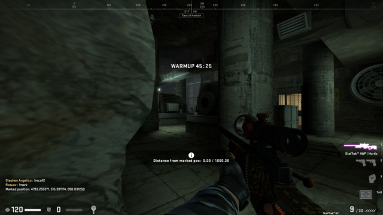
* Scoped 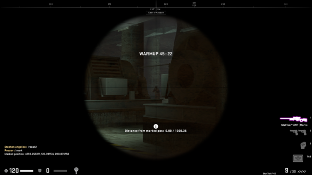
* Double-scoped 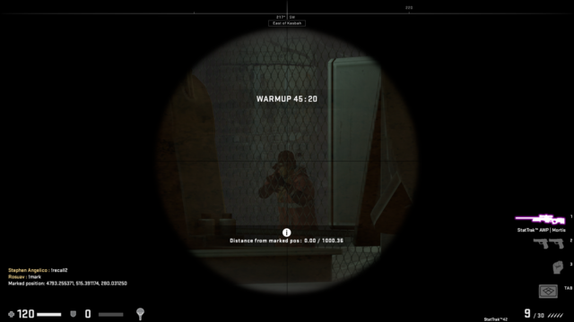
